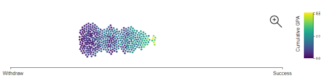
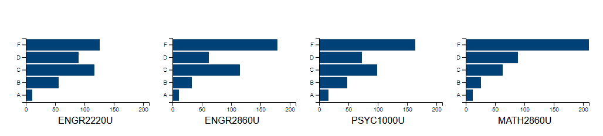

# Student Success Project

This repository includes code segments from my work with the Ontario Tech University student dataset. This work was conducted as part of my Master's thesis and includes elements of data science, information visualization, and user experience research and design.

## random_forest_model.py

Queries a MySQL database to train a scikit-learn random forest classifier model and saves the model for future use.

## beeswarm.js

In general, a beeswarm plot displays values as points distributed along a horizonal axis. Points in the same area cluster vertically to clearly show density around a single value. This file uses D3.js to display the results of a the machine learning model (*random_forest_model.py*).

The beeswarm plot below displays the model results for a single student in their current semester. The system uses a statistical sampling technique (*sampling_technique.py) to generate likely sets of grades. Each set of grades is fed into the model which returns a *prediction probability* score which indicates how likely the students is to succeed (not withdraw) if they recieve that set of grades in their current semester. The points are coloured based on the average GPA of the set of grades (dark -> low GPA; light -> high GPA).



## bar_charts.js

These bar charts accomany the beeswarm plot to describe the data being fed into the model. Each chart represents a single course and shows the distribution of the grades generated by the system for that course. The user can select a group of points on the beeswarm plot and see the specific grades behind the predictions.



## sampling_technique.py

This script uses a normal distribution and random sampling to select and assign probable grades to selected courses. This process involved a few steps which I have described with some modified python code below. I used pandas for storage and manipulation, and numpy for math and statistics.

1. Set up a normal distribution across all cumulative GPAs in the dataset. The data was imported from a MySQL database and stored in a pandas dataframe. The overall cumulative GPA for each student in the dataset is stored in an array called *cgpa_array*.

  The following code uses *cgpa_array* to calculate the mean and standard deviation of the distribution of cumulative GPAs.

  ```Python
  def get_truncated_normal(mean=0, sd=1, low=0, upp=10): #not my function
      return truncnorm(
          (low - mean) / sd, (upp - mean) / sd, loc=mean, scale=sd)
```
  ```Python
  mu, std = norm.fit(cgpa_array) #fit normal curve to array of student_stds (std_arr)
  dist = get_truncated_normal(mean = mu, sd = std, low = 0, upp = 4.3)
  X = dist.rvs(10000)

  dist_params = {'mu': [mu], 'std': [std]}
  dist_params = pd.DataFrame.from_dict(dist_params)
```

2. Calculate the cumulative GPA of the student.

3. Set up a normal distribution using the standard deviation from *Step 1*, and the mean from *Step 2*. This is the *sampling distribution*

4. Sample a cumulative GPA from the *sampling distribution*.

5. Select a grade scenario from the grade scenario probability table using the sampled GPA. The following code uses a numpy package to perform weighted random sampling. Each grade scenario in list *elements* has a probability of being selected, *scenario_probs*.

  ```Python
  rnd = np.random.choice(elements ,p=list(scenario_probs))
  ```

6. Assign each of the grades in the selected scenario to one of the selected courses using weighted random assignment. `np.random.choice()` can only be used if the sum of the probability array is 1. Since


7. Repeat *Steps 4 - 6* for the desired number of samples.
